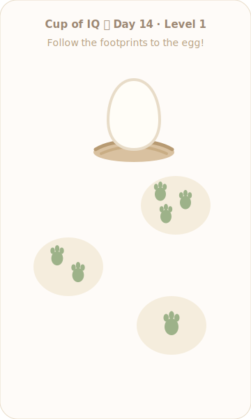
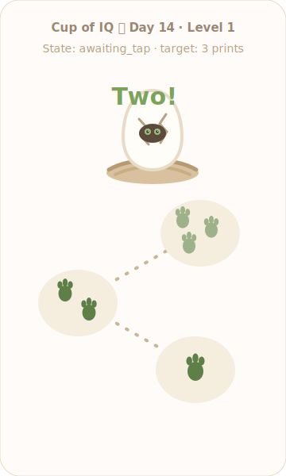
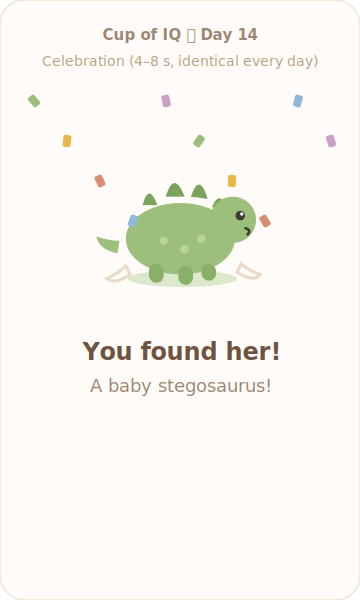
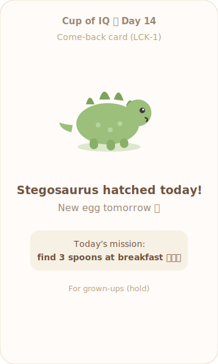

# Cup of IQ — Design (v2, 2026-07-08)

*v2 incorporates `learning-review.md` R1–R8 and the prototyping session of 2026-07-08 (sign-offs #12–16). New/changed: §3 board specs, §4 content, §7b L1 implementation, §9 audio, §11 reference implementation. The stack (§1) and architecture shape (§2) are unchanged.*

## 1. Tech stack decision ⚠️ (parent sign-off #1)

**Chosen: plain HTML + plain CSS + vanilla TypeScript, bundled by Vite. No UI framework. Content as JSON in the repo. GitHub Pages hosting deployed by GitHub Actions. Vitest for logic tests.**

### Why

The product is one interactive screen plus two static-ish screens, maintained part-time by one person for years. The dominant risks are *dependency churn* and *complexity creep*, not rendering scale. A framework's value — reconciling complex state across deep component trees — doesn't exist here; the whole game is a ~10-state machine over ~15 DOM nodes. Vanilla TS keeps the dependency surface to one dev-time tool (Vite) that never ships to the browser, loads fastest for a toddler-length attention span, and will still build unmodified in five years. TypeScript (over plain JS) earns its keep by type-checking the content files and the localStorage schema — the two places a solo maintainer will make silent mistakes at 11 pm.

### Candidates actually weighed

| Candidate | Verdict | Why |
|---|---|---|
| **Vanilla TS + Vite** ✅ | **Chosen** | Zero runtime deps, ~15 KB JS shipped, trivial mental model, TS safety on content. Vite is thin and replaceable (esbuild/Rolldown compatible) if it ever rots. |
| Astro (islands SSG) | Rejected | Excellent tool, wrong shape: its value is content-heavy multi-page sites. Our one interactive island would be written in vanilla anyway. Revisit only if the site grows many content pages. |
| Next.js / SvelteKit static export | Rejected | Heavy toolchains with frequent breaking majors; hundreds of transitive deps to `npm audit` forever. |
| Zero-build vanilla JS (no bundler) | Seriously considered, rejected narrowly | Ages the best of all — but loses TypeScript, content type-checking, minification, and dead-simple test tooling. Documented as the escape hatch: the runtime code has no framework idioms, so dropping the build step later is a day's work, not a rewrite. |

### The rest of the axes

- **Styling:** one plain CSS file (`src/styles.css`) with custom properties for the palette. No Tailwind/PostCSS plugins.
- **Daily content:** JSON files in `content/`, validated by a Vitest test at build time. No CMS, no API.
- **State:** `localStorage` under a single versioned key. Schema in §5.
- **Sharing:** Web Share API → clipboard fallback; static OG tags. §8.
- **Hosting/CI:** GitHub Pages + one GitHub Actions workflow (test → build → deploy on push to `main`). Commit the `CNAME` file into `public/` so deploys never drop the custom domain; with a custom domain, Vite `base` stays `/`. Cloudflare Pages is the noted fallback.
- **Testing:** Vitest unit tests on the pure logic (daily index, shuffle determinism, board specs, level-up rules, share text, content validity). Pin the timezone (`TZ=America/New_York` in the Vitest config / Actions workflow) so DST-boundary tests for `dayNumber` are deterministic. No E2E framework — the manual on-device checklist (tasks.md) catches what matters (fat-finger feel, animation timing), and `prototype/prototype-l1.html` (§11) is the reference for feel.

## 2. Architecture overview

```
                    ┌────────────────────────────────────┐
                    │  index.html (static, OG tags)      │
                    └──────────────┬─────────────────────┘
                                   │ boots
                    ┌──────────────▼─────────────────────┐
                    │ main.ts — decide today's screen    │
                    │  played today? ──yes──► comeback   │
                    │       │ no                         │
                    │       ▼                            │
                    │  game.ts (state machine)           │
                    └───┬──────────┬──────────┬──────────┘
                        │          │          │
              daily.ts  │ progress.ts│  share.ts
        (dayNumber,     │ (localStorage,      (Web Share /
         boardSpec,     │  level-up rules)     clipboard,
         seeded shuffle,│                      text builder)
         dino pick)     │        feedback.ts (anims, sfx,
                        ▼         number words)
          content/dinos.json · titles.json · prompts.json · missions.json
          public/img/* · public/sfx/* · public/voice/*
```

Everything below `main.ts` is pure functions plus a thin DOM layer; the state machine is the only stateful object.

**Game states:** `idle → awaiting_tap ⇄ (target_correct | target_incorrect) → complete → celebration → results`, plus the standalone `comeback` screen. Round state: `{ target, wrongTaps, missStreak, revealStage }`. `revealStage` (0..N) is new in v2 and drives the progressive reveal (TRL-2); it only ever increments.

## 3. Daily algorithms and board specs

```ts
// daily.ts
const LAUNCH_DATE = new Date(2026, 8, 1); // ⚠️ placeholder (sign-off #7) — set on go-live day.
// IMMUTABLE once the first real result is shared: changing it renumbers every
// day and reshuffles every board.

export function dayNumber(now = new Date()): number {
  const localMidnight = new Date(now.getFullYear(), now.getMonth(), now.getDate());
  const MS = 86_400_000;
  // Math.round (not floor) is deliberate: it absorbs DST's 23/25-hour days,
  // since local-midnight diffs are then ±1 h off an exact multiple of 24 h.
  const day = Math.round((localMidnight.getTime() - LAUNCH_DATE.getTime()) / MS) + 1;
  return Math.max(1, day); // pre-launch visits clamp to Day 1 — JS % preserves
                           // sign, so day ≤ 0 would index dinos[-1] = undefined
}

function posMod(n: number, m: number): number { return ((n % m) + m) % m; }

export function todaysDino(day: number, dinos: Dino[]): Dino {
  return dinos[posMod(day - 1, dinos.length)];
}
export function todaysPrompt(day: number, prompts: string[]): string {
  return prompts[posMod(day - 1, prompts.length)];
}
export function todaysMission(day: number, missions: Mission[]): Mission { // Phase 2
  return missions[posMod(day - 1, missions.length)];
}

// v2: replaces numbersForLevel(). One source of truth for BRD-1.
export type TargetFace = 'prints' | 'prints+numeral' | 'numeral';
export type LayoutId = 'scatter3' | 'quincunx5' | 'grid10';
export interface BoardSpec {
  values: number[];      // completion order = ascending values
  face: TargetFace;
  layout: LayoutId;
  minTargetPx: number;
  revealAfterTap: Record<number, RevealStage>; // TRL-2 stage table
}
export type RevealStage = 'crackA' | 'crackA2' | 'crackB' | 'peek' | 'hatch';

export function boardSpecForLevel(level: number): BoardSpec {
  switch (Math.min(Math.max(level, 1), 5)) { // BRD-5 clamp
    case 1: return { values: [1,2,3],        face: 'prints',         layout: 'scatter3',  minTargetPx: 100,
                     revealAfterTap: { 1:'crackA', 2:'peek', 3:'hatch' } };            // peek stage implies crackB
    case 2: return { values: [1,2,3,4,5],    face: 'prints+numeral', layout: 'quincunx5', minTargetPx: 88,
                     revealAfterTap: { 1:'crackA', 2:'crackA2', 3:'crackB', 4:'peek', 5:'hatch' } };
    case 3: return { values: [1,2,3,4,5],    face: 'numeral',        layout: 'quincunx5', minTargetPx: 88,
                     revealAfterTap: { 1:'crackA', 2:'crackA2', 3:'crackB', 4:'peek', 5:'hatch' } };
    case 4: return { values: [6,7,8,9,10],   face: 'numeral',        layout: 'quincunx5', minTargetPx: 88,
                     revealAfterTap: { 1:'crackA', 2:'crackA2', 3:'crackB', 4:'peek', 5:'hatch' } };
    default: return { values: [1,2,3,4,5,6,7,8,9,10], face: 'numeral', layout: 'grid10', minTargetPx: 64,
                     revealAfterTap: { 2:'crackA', 5:'crackB', 8:'peek', 10:'hatch' } };
  }
}

// mulberry32 — tiny deterministic PRNG, seeded per day+level
export function seededShuffle<T>(items: T[], seed: number): T[] { /* Fisher–Yates driven by mulberry32(seed) */ }
export function boardSeed(day: number, level: number): number { return day * 100 + level; }
```

**Worked example (Level 1).** Launch = 2026-09-01; on 2026-09-14 `dayNumber` = **14**; `todaysDino` with 30 dinos = `dinos[13]` → Baby Stegosaurus. `boardSeed(14, 1)` = **1401**; `seededShuffle([1,2,3], 1401)` yields e.g. `[3,2,1]`, assigned in order to scatter slots **A, B, C** (§7b geometry): slot A shows 3 footprints, slot B shows 2, slot C shows 1. Every L1 device on Day 14 sees exactly that scatter and hatches exactly that Stegosaurus. `todaysPrompt(14, prompts)` picks the same parent prompt everywhere.

⚠️ Sign-off #3: "today" is the device-local calendar date (the Wordle choice). ⚠️ Sign-off #13/BRD-3: the shuffle assigns *values to slots*; slot positions themselves are fixed per layout and chosen so no assignment yields a spatially ordered path.

## 4. Content schemas

`content/dinos.json` — append an entry + drop one image to add a day (NFR-6). Launches at ~30 entries; repeats accepted per sign-off #11:

```json
[
  {
    "id": "stegosaurus",
    "displayName": "Baby Stegosaurus",
    "emoji": "🦕",
    "image": "img/dinos/stegosaurus.webp",
    "funFact": "Plates like leaves on its back!"
  }
]
```

`content/titles.json` — the accuracy ladder ⚠️ (sign-off #8), grown-up-facing only (CEL-2): unchanged from v1 (T-Rex/Triceratops/Stegosaurus/Brontosaurus at 0/1/2–3/4+).

`content/prompts.json` *(new, MVP — PRM-1)* — flat array of grown-up strings, rotated by `dayNumber`:

```json
[
  "Try together: count his fingers to 3 today",
  "Try together: count the stairs on the way down",
  "Try together: line up 3 crackers, eat them one… two… three!"
]
```

`content/missions.json` *(new, Phase 2 — MSN-1)* — daily real-world counting missions for the comeback card:

```json
[
  { "text": "find 3 spoons at breakfast", "emoji": "🥄", "count": 3 },
  { "text": "spot 2 birds outside", "emoji": "🐦", "count": 2 }
]
```

`public/voice/manifest.json` *(new, MVP — AUD)* — maps values/events to audio files so `feedback.ts` never hardcodes paths:

```json
{ "1": "voice/one.m4a", "2": "voice/two.m4a", "3": "voice/three.m4a",
  "…": "…", "10": "voice/ten.m4a", "rawr": "voice/rawr.m4a" }
```

A Vitest content test enforces: unique dino ids, images exist and are WebP ≤ 60 KB, title ladder ordered and exhaustive, prompts/missions non-empty, every value in every `boardSpecForLevel().values` has a voice file ≤ 25 KB.

## 5. localStorage schema

Single key `cupofiq.v1` (version bump = migration function in `progress.ts`). Unchanged from v1 except `level` now ranges 1–5:

```json
{
  "schemaVersion": 1,
  "level": 2,
  "perfectsAtLevel": 0,
  "lastPlayed": {
    "dayNumber": 14, "levelPlayed": 1, "wrongTaps": 0,
    "dinoId": "stegosaurus", "titleId": "t-rex", "leveledUp": true
  }
}
```

- Lock check (LCK-1): `lastPlayed.dayNumber === dayNumber(now)`.
- Level-up (PRG-2): on a perfect round, `perfectsAtLevel++`; at 3 → `level++` (cap 5), reset counter, `leveledUp: true`.
- In-progress rounds are never persisted (LCK-4); a reload resets `wrongTaps` and `revealStage` — accepted loophole, sign-off #9.
- No history array, no PII. If localStorage throws (private mode), the game runs stateless (NFR-7): no lock, so the comeback card never shows in private mode and sharing is only available from the results screen within the same session. This is correct behavior — do not "fix" it.

## 6. Component breakdown

Vanilla-TS "components" are modules exporting `mount(el, props)`-style functions; kebab-case filenames per CLAUDE.md.

| Module | Responsibility (v2 changes in **bold**) |
|---|---|
| `src/main.ts` | Boot: read state, compute day, route to game or comeback screen |
| `src/game.ts` | State machine; owns `{ target, wrongTaps, missStreak, `**`revealStage`**` }`; consults `boardSpec.revealAfterTap` on each correct tap |
| `src/board.ts` | **Renders targets per `BoardSpec`: face renderer (`prints` / `prints+numeral` / `numeral`), layouts (`scatter3` incl. nest scene + trail overlay, `quincunx5`, `grid10`)**; exposes `complete(v)`, `wobble(v)`, `hint(v)`, **`drawTrailSegment(n)`**, **`advanceReveal(stage)`** |
| `src/daily.ts` | `dayNumber`, `boardSeed`, `seededShuffle`, `todaysDino`, **`boardSpecForLevel`, `todaysPrompt`, `todaysMission`** — pure, fully unit-tested |
| `src/progress.ts` | localStorage read/write, schema migration, level-up rules (cap **5**) — pure core, tested |
| `src/feedback.ts` | Plays stamp/crack/wobble/hint/hatch animations + sfx; **`sayNumber(v)` and `rawr()` via the voice manifest; lazy-loads audio after first paint; unlocks audio context on first tap (AUD-4)**; respects sound-off |
| `src/share.ts` | `buildShareText(result)` (**L1 adds the "We followed the tracks" line**), `share()` with Web Share → clipboard fallback |
| `src/screens/results.ts` | Results: dino, title, wrong taps, perfect treatment, **parent prompt (PRM-1)**, share/copy, grown-ups control |
| `src/screens/comeback.ts` | Come-back card (LCK-1): static dino, share controls, **counting mission (MSN-1, Phase 2)** |
| `src/screens/grownups.ts` | Long-press-gated panel: **level picker with 5 named levels**, sound toggle, reset, privacy note |
| `content/` | `dinos.json`, `titles.json`, **`prompts.json`**, **`missions.json`** |
| `public/img`, `public/sfx`, **`public/voice`** | Static assets |
| **`prototype/prototype-l1.html`**, **`mockups/*.svg`** | **Reference implementation + spec screenshots (§11). Not shipped; excluded from the build.** |

## 7. Incorrect-tap feedback design ⚠️ (sign-off #2)

Unchanged from v1: **wobble + patient hint** (Option C). Wobble ±8° for 500 ms with a soft two-note descending marimba "hmm?"; after 3 consecutive misses on the same target, the correct target starts a slow gentle bounce every 4 s until tapped (FBK-3). Wordless, language-free, zero sting; textbook Montessori control of error per `learning-review.md`. The optional recorded "Not that one yet!" line stays in the Phase 2 backlog, off by default.

## 7b. Level 1 "Follow the tracks" — implementation spec (new in v2)

This section plus `prototype/prototype-l1.html` is everything a developer needs to build the L1 screen. The prototype is the timing/feel source of truth; the numbers below are extracted from it.

### Scene geometry

Logical scene: **336 × 452** units (scale to viewport width; the whole scene fits one phone screen with the header above it — no scrolling, ever). All coordinates below are in scene units.

| Element | Position (anchor) | Notes |
|---|---|---|
| Nest + day egg | egg-base center ≈ **(172, 112)**; nest svg 150×128 centered at top | Egg carries the reveal layers |
| Scatter slot **A** | patch center **(240, 212)** | upper right |
| Scatter slot **B** | patch center **(86, 300)** | middle left |
| Scatter slot **C** | patch center **(234, 384)** | lower right |
| Trail overlay | full-scene `<svg>` with 3 pre-positioned dashed `<line>`s at opacity 0 | `stroke:#C9B694; stroke-width:4; stroke-dasharray:2 12; stroke-linecap:round` |
| "hmm?" text | bottom center | opacity-toggled, 700 ms |
| Word bubble | top center, above nest | see AUD/word-bubble timing below |

Trail waypoint order is fixed **C → B → A → nest** (a zigzag). The daily shuffle assigns *quantities* to slots A/B/C; the child's tap order is always quantity order (1 → 2 → 3), so the drawn path is always C-slot-of-1 → slot-of-2 → slot-of-3 → nest… **Correction for implementers:** the trail segments connect *the slots in the order tapped* (slot of value 1, then slot of value 2, then slot of value 3, then nest). Compute segment endpoints from the slot centers at round start after the shuffle; do not hardcode C→B→A. The zigzag slot geometry guarantees no assignment produces a straight path (BRD-3).

Patch hit area: **104 × 96** (≥ 100 px rendered, BRD-1), ellipse ground `#F5EDDD`, footprints `#9DB289` → stamped `#5F7F49`. Footprint = pad ellipse + three toe ellipses (see prototype SVG for exact geometry; also `mockups/01-l1-round-start.svg`).

### Reveal layers on the day egg

The egg SVG contains stacked, individually toggleable layers (all in the prototype):

1. `crackA` — zigzag path, left of center
2. `crackB` — zigzag path, right of center
3. `peek` — dark opening ellipse + two green eyes with highlights (implies crackB visible)
4. `hatch` — swap to the celebration screen: dino pops (popin 600 ms) with two shell halves on the ground

### Interaction & timing table (source of truth: prototype)

| Event | Response | Timing |
|---|---|---|
| Correct tap | patch stamps (scale 1→1.18→1), prints darken | 450 ms, starts < 100 ms after tap (TAP-3) |
| " | number word audio `sayNumber(v)` | starts ≤ 150 ms (AUD-1) |
| " | word bubble pop-rise-fade | 1.4 s (AUD-2) |
| " | trail segment N opacity 0→1 | 600 ms ease (TRL-1) |
| " | egg advances reveal stage + nest jiggle ±3° | jiggle 400 ms, ≤ 450 ms total (TRL-2) |
| Wrong tap | wobble ±8° on tapped patch; "hmm?" chime + text | wobble 500 ms; text 700 ms (FBK-1) |
| 3rd consecutive miss on same value | correct patch bounce −14 px, every 4 s | until tapped (FBK-3) |
| Final correct tap | pause, then celebration screen | 600–700 ms pause; hatch completes < 1 s (REV-1) |
| Celebration | dino popin 600 ms → dance loop 0.6 s/cycle; "rawr" (AUD-5); confetti only if perfect (26 pieces, 1.7–3.1 s fall) | total 4–8 s (CEL-1), then auto-results (CEL-3) |
| Idle | patches bob ±4 px, staggered delays (0 / .35 / .7 s) | 3.2 s loop; disabled under `prefers-reduced-motion` |

All animations are CSS keyframes (no JS animation loops, no libraries); names and exact keyframes are in the prototype (`bob`, `wobble`, `hintb`, `popin`, `stamp`, `jiggle`, `dance`, `wordpop`, `fall`). Input is never locked > 150 ms (TAP-6): taps on other patches register during any animation.

### L2 note

L2 reuses the `quincunx5` egg layout from the original design with the `prints+numeral` face: the numeral (huge, charcoal, dominant) with the matching footprint count in a small row beneath it. No trail at L2+ (the trail is L1's scaffold); the progressive reveal (TRL-2) continues at all levels via the day egg displayed above the board.

## 8. Sharing implementation

```ts
// share.ts — L1 output:
// Cup of IQ 🥚 Day 14
// We followed the tracks — Baby Stegosaurus hatched!
// 🦖 T-Rex round — 0 wrong taps ⭐
// https://cupofiq.com
// (L2+ omits the tracks line)
```

1. `navigator.share({ text })` when available (SHR-3).
2. Fallback + always-visible Copy button: `navigator.clipboard.writeText(text)` + "Copied!" toast (SHR-4).
3. Link preview (SHR-6): static OG tags + one hand-drawn 1200×630 `og-image.png`. ⚠️ Sign-off #4: no per-day OG image.

## 9. Asset plan

**Look (unchanged):** warm, hand-drawn, storybook — cream background, thick soft outlines, warm pastel palette. Baby-proportioned dinos: big eyes, round bodies, friendly. Palette anchors: cream `#FEFBF8`, brown `#6E5340`, soft brown `#9B8672`, tan `#B7A182`, green `#9CBF7B`, print-green `#9DB289`/`#5F7F49`.

- **Eggs (L2+):** one SVG, cream with per-slot speckle color; huge high-contrast rounded numeral; L2 adds the footprint row. Crack states as toggleable layers (§7b pattern).
- **L1 scene:** nest (twig arcs over a sand mound), day egg with reveal layers, footprint patches, dashed trail. All SVG; the prototype's geometry is the starting point for the hand-drawn pass.
- **Dinos:** 512 px transparent **WebP**, **≤ 60 KB per image**, enforced by the Phase 1 content test. One per species; style locked by `assets/STYLE.md` written before the first image.
- **Sound (sfx):** ≤ 5 short files, quiet by default, CC0 or home-recorded: crack-pop, "hmm?" marimba, hatch fanfare, 5 s dance loop, confetti chime. Everything playable muted (FBK-5).
- **Voice (new, MVP):** the **hatchling voice** — number words "one" through "ten" plus one "rawr" (11 files). Recorded by the parent (or the kid: a time capsule), doing a small squeaky dino voice: pitched up, slow, one word per file, playful. Production: record on a phone in a quiet room, trim silence, normalize volume, export mono AAC `.m4a` at ~48–64 kbps, **≤ 25 KB per file** (a single word is < 1 s). Files live in `public/voice/` with `manifest.json` (§4). **No TTS anywhere in the product** (AUD-3) — the prototype's speechSynthesis is a stand-in only. Playback rules: lazy-load after first paint, unlock on first tap, cut-off-not-queue on rapid taps (AUD-1/4).
- **Animation:** CSS transforms/keyframes only — no animation library. Confetti = ~26 CSS-animated divs, removed after.

## 10. Seams for future modes (design for, don't build)

Unchanged from v1: routing seam (one route per mode), shared-for-real modules extracted only when Mode 2 lands (`daily`, `progress`, `share`, `feedback`), board rendering never shared, no generic engine. Level names in the grown-ups panel come from BRD-1. Parking lot (SAT/adult modes) unchanged.

## 11. Reference implementation & mockups (new in v2)

A developer picking this up cold should, in order: (1) play `prototype/prototype-l1.html` in a browser — it is the **feel/timing source of truth** for §7b; (2) read `learning-review.md` for *why* the design is shaped this way; (3) build the real thing per §6, treating the prototype as disposable.

**`prototype/prototype-l1.html`** — single-file, dependency-free, playable L1 round: scatter board, wobble/hint, trail drawing, 3-stage progressive reveal, hatch celebration, results with parent prompt, comeback card with mission. Inline comments map code to requirement IDs. It is **not production code**: production is modular TS (§6), uses recorded audio (not the prototype's TTS stand-in), and derives the board from `boardSpecForLevel` + the daily shuffle rather than hardcoded values.

**`mockups/`** — rendered screens for this spec (SVG; open in any browser, render inline on GitHub):

| File | Shows |
|---|---|
| `mockups/01-l1-round-start.svg` | L1 opening state: nest + pristine egg, three scattered patches (3/2/1 prints), no trail. State: `awaiting_tap`, target 1 |
| `mockups/02-l1-mid-round-peek.svg` | After two correct taps: patches 1–2 stamped dark, two trail segments drawn, egg at `peek` stage (eyes visible), word bubble "Two!" |
| `mockups/03-hatch-celebration.svg` | Hatch: dino + shell halves, "You found her! A baby stegosaurus!", confetti (perfect round) |
| `mockups/04-comeback-mission.svg` | Come-back card: static dino, "New egg tomorrow", counting-mission chip, grown-ups control |

 
 
